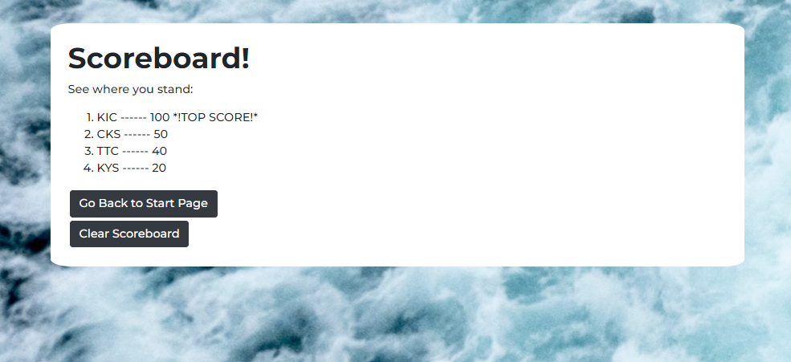

# A JavaScript Code Quiz 💻❓

***

 

## Description

This timed code quiz was created using HTML, CSS, Bootstrap, and JavaScript.  Once the user clicks the start button, they will be presented with a series of 10 questions based on JavaScript fundamentals that must be answered within 90 seconds.  The user will be penalized 5 seconds every time they click on a wrong answer.  Once they reach the end of the quiz, they may enter in their name/initials to be added to the scoreboard.  The scoreboard will be stored within the user's localStorage, which will stay stored until the user decides to either clear the scoreboard on this quiz site, or if they delete it from their browser's settings. 

Please click [here](https://christina2021.github.io/JS-Code-Quiz/) to start the quiz! 

## Usage

The first section that will show will be start of the quiz.  Once the start button is clicked, the timer will begin and the first set of question/answers will appear.

The answers will show as buttons, and may be clicked on.  If the answer is wrong, 5 seconds will be deducted from the timer, and the question will remain until the correct answer is chosen.  Once the correct answer is chosen, 10 points will be added to the user's score, and the next question will appear.  If the user answers all 10 questions, or if the timer runs out, they will have the option to submit their score to the scoreboard.

Once they enter in their initials, they will be directed to a page with the scoreboard.  This will be based on the user's local storage.  The user will have the option to clear the scoreboard, or to go back to the start quiz page.

#### Notes on Usage
⭐ Once the correct answer is selected, the user will not be able to select any other answers until the next question appears.\
⭐ However, if the wrong answer is selected, it will remain.  So be careful not to choose the wrong answer twice! 😉\
⭐ The user is not requried to enter in their initials to see the scoreboard.  If they do not enter anything, nothing will be recorded for that round.  The user will still be redirected to the scoreboard.

## What I Learned 💭
I have learned a lot more about JavaScript through coding this quiz.  When creating this site, I had to become familiar and comfortable with the JavaScript event listeners as well as the local storage.  I had been able to learn much about these features by utilizing console.log for every step that I took to check the functionality of buttons being clicked on.  I have also learned much about utilizing the browser's local storage with to how to add to the local storage as well as how to retrieve the items from the local storage.  I also became familiar with using and adding switch statements into JavaScript.

## License
[MIT](https://choosealicense.com/licenses/mit/#)